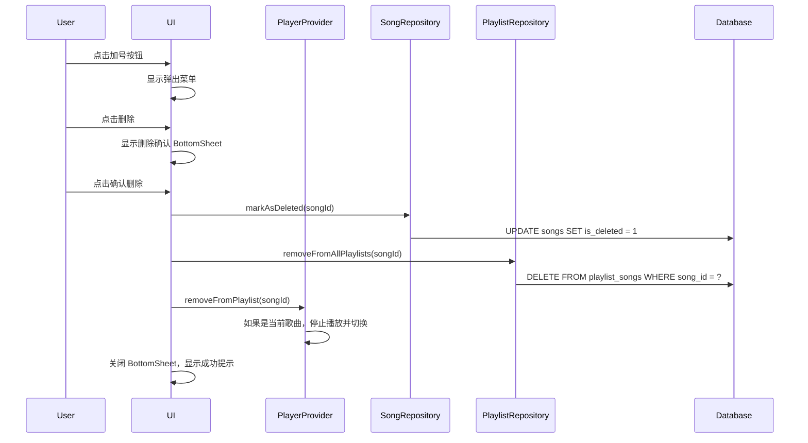

# 歌曲删除功能设计文档

## 功能概述

在播放页面的 AppBar 加号按钮下添加弹出菜单，包含"添加到歌单"、"编辑"和"删除"选项。删除时通过 BottomSheet 确认，确认后歌曲从所有歌单中移除，且再次扫描不会添加。

## 数据库变更

### 新增字段

在 `songs` 表添加 `is_deleted` 字段：

```sql
ALTER TABLE songs ADD COLUMN is_deleted INTEGER NOT NULL DEFAULT 0;
```

- 类型：INTEGER
- 默认值：0（未删除）
- 值为 1 表示已删除

### 数据库版本升级

- 当前版本：3
- 新版本：4
- 升级逻辑：在 `_onUpgrade` 中添加 ALTER TABLE 语句

### 扫描逻辑变更

`WindowsMusicScanner._saveSongsToDatabase` 方法需要修改：

1. 查询已删除的文件路径：
```sql
SELECT file_path FROM songs WHERE is_deleted = 1
```

2. 扫描时跳过已删除的路径（即使文件存在）

## UI 变更

### 1. 弹出菜单（PopupMenu）

**触发方式**：点击 AppBar 的加号按钮

**位置**：按钮下方弹出（类似微信右上角加号菜单）

**菜单项**：
| 顺序 | 文字 | 图标 | 颜色 | 行为 |
|------|------|------|------|------|
| 1 | 添加到歌单 | Icons.add_to_playlist | 默认白色 | 打开歌单选择 BottomSheet |
| 2 | 编辑 | Icons.edit | 默认白色 | 打开编辑对话框 |
| 3 | 删除 | Icons.delete | 红色 (#ef4444) | 打开删除确认 BottomSheet |

**样式**：
- 背景：`#27272a` (card)
- 圆角：`rounded-xl` (12px)
- 每项高度：48px
- 分隔线：删除项上方有一条分隔线

### 2. 删除确认 BottomSheet

**标题**：确认删除

**内容**：
- 警告图标（红色）
- 警告文字："删除后歌曲将从所有歌单中移除，且再次扫描不会添加进来"
- 歌曲名称显示

**按钮**：
| 按钮 | 文字 | 颜色 | 行为 |
|------|------|------|------|
| 取消 | 取消 | 灰色 (#71717a) | 关闭 BottomSheet |
| 删除 | 删除 | 红色 (#ef4444) | 执行删除操作 |

**样式**：
- 背景：`#27272a` (card)
- 圆角顶部：`rounded-t-3xl` (24px)
- 拖拽指示条：宽 40px，高 4px，灰色半透明

## 数据流

### 删除流程



### 扫描流程变更

```mermaid
sequenceDiagram
    participant Scanner
    participant Database

    Scanner->>Database: SELECT file_path FROM songs WHERE is_deleted = 1
    Database-->>Scanner: deletedPaths (Set)

    Scanner->>Scanner: 扫描文件系统
    for each file:
        if file.path in deletedPaths:
            Scanner->>Scanner: 跳过（不添加）
        else:
            Scanner->>Database: INSERT/UPDATE song
```

## 文件变更清单

| 文件 | 变更类型 | 说明 |
|------|----------|------|
| `database_helper.dart` | 修改 | 版本升级到 4，添加 is_deleted 字段 |
| `song_repository.dart` | 修改 | 新增 markAsDeleted 方法 |
| `playlist_repository.dart` | 修改 | 新增 removeFromAllPlaylists 方法 |
| `windows_music_scanner.dart` | 修改 | 扫描时跳过已删除路径 |
| `mobile_music_scanner.dart` | 修改 | 扫描时跳过已删除路径（如有） |
| `player_provider.dart` | 修改 | 新增 deleteSong 方法 |
| `player_page.dart` | 修改 | 重构 AppBar actions，添加弹出菜单和删除确认 BottomSheet |

## 错误处理

| 场景 | 处理方式 |
|------|----------|
| 没有播放歌曲时点击删除 | 显示 SnackBar："请先选择歌曲" |
| 删除失败 | 显示 SnackBar："删除失败"，红色背景 |
| 删除成功 | 显示 SnackBar："已删除"，accent 颜色背景 |

## 测试要点

1. **数据库升级测试**：验证从版本 3 升级到 4 后 is_deleted 字段存在
2. **删除功能测试**：
   - 删除当前播放歌曲 → 停止播放，播放列表移除
   - 删除非当前歌曲 → 仅从数据库和歌单移除
3. **扫描排除测试**：删除歌曲后重新扫描，验证不会再次添加
4. **UI 测试**：
   - 弹出菜单显示正确
   - BottomSheet 样式符合设计稿
   - 无歌曲时点击删除显示提示